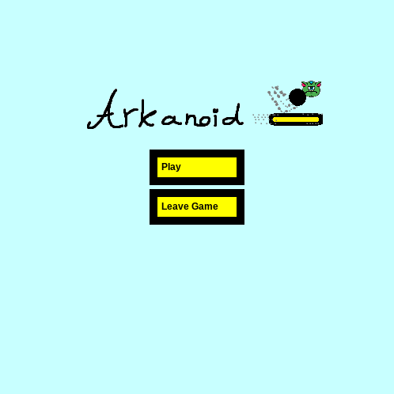
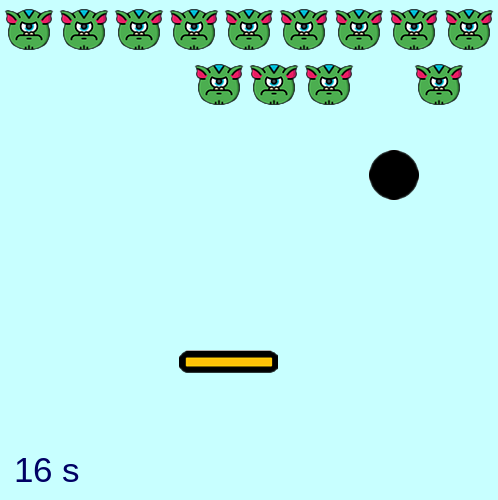

# ArkanoidV2

A game made with python

  
  

## Controls 

Left arrow == move left

Right arrow == move right

## Goal of the game

By moving the platform you avoid the ball falling to the void, or else you lose. 
